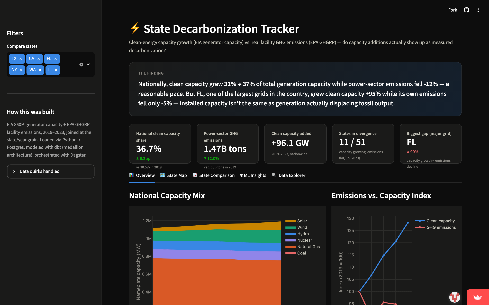
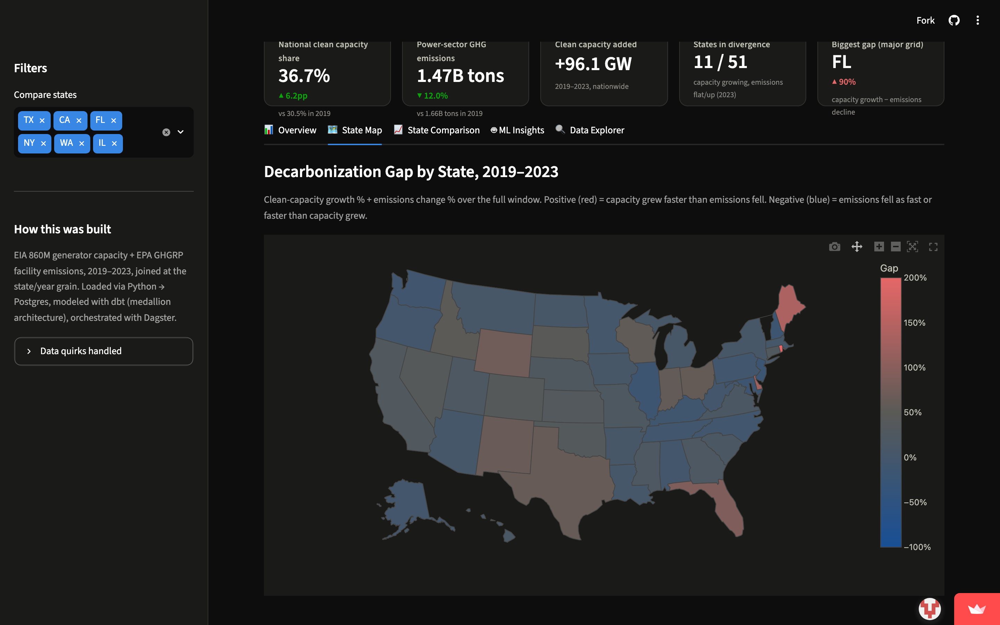
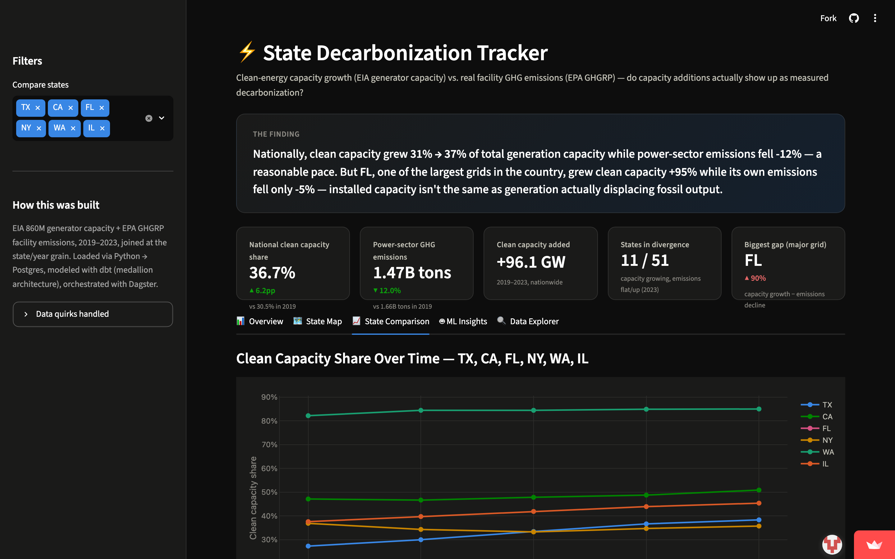
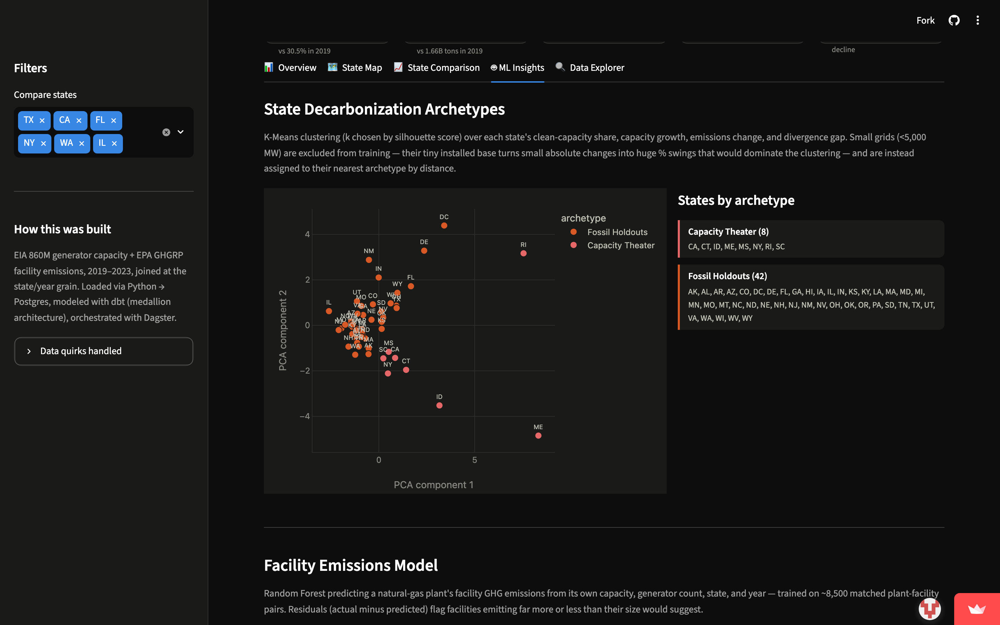

<div align="center">

# ⚡ Energy Data Lakehouse — State Decarbonization Tracker

### Is clean-energy capacity growth actually translating into falling measured emissions?

[](https://energy-lakehouse-oh6cqynxe7snjlakjrtnzu.streamlit.app)
[](https://github.com/RithikPorandla/energy-lakehouse/actions/workflows/dbt_test.yml)


</div>

A data lakehouse that ingests US energy data from three public APIs (EIA, EPA, NOAA), transforms it through a dbt medallion architecture, orchestrates the pipeline with Dagster, and surfaces a real finding through an interactive dashboard: **is clean-energy capacity growth actually translating into falling measured emissions, state by state?**

<p align="center">
  
</p>

## Contents

[The finding](#the-finding) · [Dashboard](#dashboard) · [Machine learning](#machine-learning) · [Architecture](#architecture) · [Data sources](#data-sources) · [Star schema](#star-schema) · [Quick start](#quick-start) · [Tech stack](#tech-stack) · [What this demonstrates](#what-this-demonstrates)

## 🔎 The finding

Nationally, the picture looks reasonable: from 2019 to 2023, total US power-sector clean generation capacity (solar/wind/hydro/nuclear) grew **30.5% → 36.7%** of total capacity (+28% in absolute MW), while total power-sector GHG emissions reported to EPA's GHGRP fell **~12%** (1.66B → 1.47B metric tons CO2e). (Coal capacity is counted in that denominator — see "Data quirks" below for a bug that briefly excluded it.)

But that aggregate hides a wide split at the state level. **Texas** grew clean capacity **+68%** over the same window while its power-sector emissions fell only **~5%**. **Florida** grew clean capacity **+95%** while its emissions fell **~4.5%** — installed capacity isn't the same as generation actually displacing fossil output. The K-Means archetype model (below) independently rediscovers this same split from the raw capacity/emissions numbers alone, with no state names as input — real cross-validation that it's a structural pattern, not a cherry-picked comparison.

**Is it under-utilized capacity, not just slow retirement?** With real EIA-923 generation data now in the mix (not just nameplate capacity), the answer is: partly. State-years flagged as "divergent" average a **33.4%** clean capacity factor vs. **36.1%** for non-divergent state-years — actual output is measurably lower relative to installed capacity where the divergence shows up, consistent with new capacity that hasn't ramped to full output yet. It's a real but modest effect, not the whole story — see the State Comparison tab.

Explore it yourself in the dashboard (`streamlit run dashboard/app.py`) or query `marts.mart_decarbonization_trend` directly.

## 📊 Dashboard

Five tabs, backed live by the warehouse (`dashboard/app.py`), styled with a validated colorblind-safe dark palette (`scripts/validate_palette.js` — see `dataviz` methodology):

- **Overview** — KPI row (national clean share, GHG total, capacity added, states in divergence, biggest-gap spotlight), a national fuel-mix stacked area chart, and a clean-capacity-vs-emissions index chart
- **State Map** — a US choropleth of the decarbonization gap by state (diverging blue→red)
- **State Comparison** — clean-capacity-share trend for a sidebar-selectable set of states, the capacity-growth-vs-emissions-change scatter, and the ranked gap bar chart
- **ML Insights** — the two models below: archetype clusters and the facility emissions model
- **Data Explorer** — the full `mart_decarbonization_trend` table with CSV export

<p align="center">
  
  
</p>

## 🤖 Machine learning

Two models, both written by `ml/` scripts as Dagster assets (`ml_state_archetypes`, `ml_facility_emissions_anomalies`) into a new `analytics` schema. Chosen deliberately for what the data can actually support — we have 51 states of panel data (too few rows for a supervised model to generalize) and ~50,000 plant-year records (plenty for a real regression):

**State Decarbonization Archetypes** (K-Means, `ml/archetypes.py`) — unsupervised clustering of states by clean-capacity share, capacity growth, emissions change, and divergence gap, the same technique used in published power-sector transition research (clustering countries/states into named archetypes). States under 5,000 MW of total capacity are excluded from *fitting* the model — their tiny installed base turns small absolute changes into huge % swings that would otherwise dominate the clustering — and are instead assigned to their nearest archetype by distance. `k` is chosen by silhouette score each run (ties broken toward k=4 for interpretability); on the current data k=2 wins outright (0.391 vs. 0.304 at k=4 — outside the tie-break tolerance). Result:

- **Capacity Theater** (8 states: CA, CT, ID, ME, MS, NY, RI, SC) — highest average divergence gap (0.67): clean capacity grew ~36% on average while emissions *rose* ~31% on average. This is the sharpest form of the pattern — not just "emissions didn't fall enough," but moving the wrong direction despite real capacity growth.
- **Fossil Holdouts** (42 states, incl. TX, FL, OH, IN) — lower average divergence gap (0.25): similar clean-capacity growth (~40%) but with emissions actually falling (~-14% on average). TX and FL's individual divergence (see "The finding") is real but is a within-cluster outlier here, not the cluster's defining trait at k=2 — a good illustration of why cluster labels are a starting point for investigation, not a verdict.

Silhouette scores are recomputed each run against whatever's in `mart_decarbonization_trend`, so this split (and the cluster count itself) will legitimately shift as more years of data land — that's a feature of using a real statistical criterion instead of hardcoding "4 archetypes."

<p align="center">
  
</p>

**Facility Emissions Model** (Random Forest, `ml/anomaly_detection.py`) — predicts a natural-gas plant's own GHG emissions from its capacity, generator count, state, and year, trained on ~8,500 matched plant-facility pairs, held-out R² ≈ 0.48 (MAE ≈ 419K tons). Restricted to natural gas only: even with a real ID-based facility match (below), a solar or wind plant sharing an EIA plant ID with a gas unit isn't itself the source of that facility's emissions — gas is the fuel type where the match is physically meaningful. Capacity dominates feature importance (~70%, physically expected — bigger plants emit more), with state/generator-count/year explaining the rest. Residuals (out-of-fold, 5-fold CV, not in-sample) flag facilities that emit far more or less than their size predicts.

**The match quality matters, and it improved mid-project**: `fact_plant_operations`'s plant-to-facility join now prefers EPA's official CAMD-EIA-FRS identifier crosswalk (`dbt_project/seeds/epa_frs_crosswalk.csv`) — a real ID join, not a proximity guess — falling back to the old approximate lat/long grid-cell match only for facilities the crosswalk doesn't cover (renewables aren't CAMD-regulated, so they always fall back). `match_type = 'crosswalk_exact'` replaces the old match-multiplicity heuristic as the "is this confident enough to showcase as a single plant's anomaly" signal — ~3,100 of the ~8,500 training rows are exact matches. Even so, a small residual risk remains: a handful of sites host more than one fuel type under the same EIA plant ID, so a real gas unit's crosswalk match can occasionally include a co-located facility's full site emissions rather than just its own. The dashboard surfaces the outlier list with that caveat front and center; treat it as leads worth checking, not confirmed findings. The R² and feature-importance results are robust regardless (they're aggregate statistics, not dependent on any single match being clean).

## 🏗️ Architecture

```
[EIA 860M API]      ──┐  (nameplate capacity, 2019-2023 Dec snapshots)
[EIA-923 API]       ──┤  (actual net generation, same window)
[EPA GHGRP API]     ──┼──→ [Dagster Pipeline] ──→ [PostgreSQL]
[NOAA Weather]      ──┘         │                     │
[EPA CAMD-EIA-FRS] ──(seed)──┐  │                     │
                              │  │                     ▼
                       orchestrates          [dbt Transforms]
                       schedules             raw → staging → intermediate → marts
                       monitors                    │  ▲
                                                    │  └── epa_frs_crosswalk (seed)
                                                    ▼
                                        marts.mart_decarbonization_trend
                                        (the headline insight, incl. capacity factor)
                                               +
                                        star schema: fact_plant_operations,
                                        dim_plant, dim_location, dim_time
                                               │
                                               ▼
                                     [ml/ — scikit-learn, Dagster assets]
                                     K-Means archetypes + Random Forest
                                     facility emissions model
                                               │
                                               ▼
                                        analytics.ml_state_archetypes
                                        analytics.ml_facility_emissions_anomalies
                                               │
                                               ▼
                                    Streamlit + Plotly dashboard
```

## 🗂️ Data sources

| Source | Data | Years | API key |
|---|---|---|---|
| EIA 860M | Generator nameplate capacity, fuel type, location | 2019-2023 (Dec snapshots) | Yes (free) |
| EIA-923 | Actual net generation (MWh) by plant x fuel type | 2019-2023 (annual) | Yes (same free key) |
| EPA GHGRP | Real facility-level annual GHG emissions (power sector only) | 2019-2023 | No |
| NOAA CDO | Daily weather (5 stations near major renewable installations) | 2019-2023 | No |
| EPA CAMD-EIA-FRS crosswalk | Official plant↔facility ID bridge (GitHub, static file) | n/a (seed) | No |

Things about these sources that aren't obvious from the original tutorial this project started from, and matter for correctness:

- **EPA's API moved.** `data.epa.gov/efservice` is being superseded by `data.epa.gov/dmapservice`. More importantly, the facility table (`PUB_DIM_FACILITY`) is metadata only — no emissions numbers. Real annual CO2e totals live in `PUB_FACTS_SECTOR_GHG_EMISSION`, joined by `facility_id` + `year`. See [src/ingestion/epa.py](src/ingestion/epa.py).
- **That facts table mixes two incompatible measures.** Direct-emitter sectors (`sector_type='E'`, e.g. Power Plants) report a facility's own on-site emissions. Supplier sectors (`sector_type='S'`, e.g. Petroleum Suppliers) report the *potential* emissions embedded in fuel sold downstream for someone else to burn. Summing both double-counts the same carbon. This build filters to `sector_id=3` (Power Plants) only — verified against the known ~1.6-1.7B ton nationwide power-sector total for 2019.
- **EIA's two endpoints use two different coal taxonomies.** The generator-capacity endpoint (Form 860) uses granular coal codes (`BIT`/`SUB`/`LIG`/`WC`/`RC`/`SGC`/`ANT`); the generation endpoint (Form 923, `facility-fuel` route) uses the aggregated `COL` code. Filtering the 860 endpoint on `COL` silently returns zero rows instead of erroring — that's how ~210 GW of national coal capacity went missing from the fossil denominator for a while (see [src/ingestion/eia.py](src/ingestion/eia.py)).
- **EPA's GHGRP facility ID isn't an EIA plant ID.** There's no shared key between the two systems directly. EPA does publish an official bridge — the CAMD-EIA-FRS crosswalk (`github.com/USEPA/camd-eia-crosswalk`) — which links GHGRP's `frs_id` to `CAMD_PLANT_ID` (the same ORISPL numbering as EIA `plant_id` for the large majority of plants). `int_plant_emissions.sql` uses this as a real ID join (`match_type = 'crosswalk_exact'`), falling back to an approximate state + rounded-lat/long match only for facilities the crosswalk doesn't cover.

## ⭐ Star schema

- `mart_decarbonization_trend` — **the headline mart.** State × year: clean capacity share, real GHG totals, real generation and capacity factor (EIA-923), YoY deltas, divergence flag.
- `fact_plant_operations` — plant-level operational detail (capacity, nearby facility emissions and `match_type` where matched — crosswalk-exact or geo-approximate)
- `dim_plant`, `dim_location`, `dim_time` — supporting dimensions (one row per key — see "Data quirks" for a dimension-grain bug that was fixed)

## 🚀 Quick start

```bash
# 1. Start Postgres
docker compose up -d

# 2. Python env (3.10+ required)
python3.12 -m venv venv && source venv/bin/activate
pip install -r requirements.txt

# 3. Ingest (needs a free EIA key in .env — https://www.eia.gov/opendata/register.php)
python -m src.ingestion.eia
python -m src.ingestion.eia_generation
python -m src.ingestion.epa
python -m src.ingestion.noaa

# 4. Transform (dbt seed loads the EPA-EIA crosswalk)
cd dbt_project && dbt deps && dbt seed && dbt run && dbt test && dbt docs generate && cd ..

# 5. ML (state archetypes + facility emissions model)
python -m ml.archetypes
python -m ml.anomaly_detection

# 6. Orchestrate (optional — runs the whole pipeline, including ML, as Dagster assets)
export PYTHONPATH=$(pwd)
dagster dev -m dagster_project.definitions
# open http://localhost:3000, materialize all assets

# 7. Dashboard
streamlit run dashboard/app.py
```

## 🧰 Tech stack

Python, dbt, Dagster, PostgreSQL, Docker, scikit-learn, Streamlit/Plotly, GitHub Actions

## ✅ What this demonstrates

1. **dbt** — staging → intermediate → marts, schema tests, docs, packages (`dbt_utils`), seeds (official EPA-EIA crosswalk)
2. **Dagster** — software-defined assets with real dependencies (ingestion → transform → test → ML), schedules, sensors
3. **Dimensional modeling** — star schema (facts + dimensions) alongside a purpose-built analytical mart, with an enforced one-row-per-key grain on the plant dimension
4. **Medallion architecture** — raw → staging → intermediate → marts → analytics, all schema-separated in Postgres
5. **Machine learning matched to what the data supports** — unsupervised clustering for a 51-row population (too small for supervised learning), a real regression for a ~8,500-row population, both with honestly reported metrics and limitations rather than overclaimed accuracy
6. **Real vs. approximate joins, and knowing the difference** — replaced a lat/long proximity guess with EPA's official CAMD-EIA-FRS identifier crosswalk where it's available, kept the approximate join as an explicit, labeled fallback rather than pretending both are equally trustworthy
7. **Capacity vs. actual output** — brought in real EIA-923 generation data specifically to test whether "installed capacity" claims hold up as real output, rather than stopping at nameplate MW
8. **Data quality** — dbt tests, plus real-world data validation (catching a nationwide GHGRP emissions total that was 4-5x too high before it reached any model, ~210 GW of coal capacity silently missing from a fossil-fuel denominator due to a fuel-code taxonomy mismatch between two EIA endpoints, and a dimension table that wasn't actually enforcing its own grain)
9. **API integration under real-world conditions** — an API that moved endpoints mid-project, a metrics table that silently mixed two incompatible measures, pagination limits, and a broken IPv6 path that had to be diagnosed and worked around
10. **CI/CD for data** — GitHub Actions running `dbt seed`/`run`/`test` on every PR against small, real fixture data (`tests/fixtures/`) instead of depending on live third-party APIs for a fast, deterministic pipeline check
11. **Docker** — containerized PostgreSQL with medallion schemas
12. **Analytics presentation** — actual findings, not just tables, shown through an interactive dashboard
